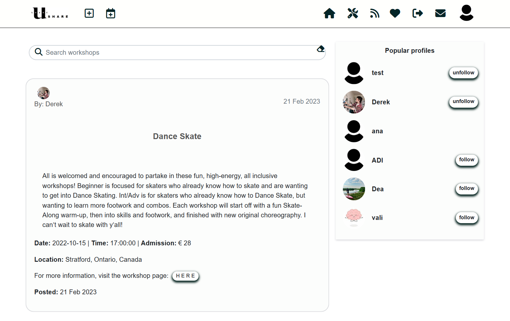

# Table of Contents

1. [Introduction](#introduction)

2. [UX](#ux)
    1. [The Strategy Plane](#the-strategy-plane)
    2. [Agile Methodology](#agile-methodology)
    3. [The Scope Plane](#the-scope-plane)
    4. [The Structure Plane](#the-structure-plane)
    5. [The Skeleton Plane](#the-skeleton-plane)
    6. [The Surface Plane](#the-surface-plane)

3. [Features](#features)
    1. [Components](#components)
    2. [Pages](#pages)
    3. [Features left to implement](#features-left-to-implement-possible-future-sprints)

4. [Testing](#testing)

5. [Bugs](#bugs)
    1. [Fixed](#fixed)
    2. [Unfixed](#unfixed)

6. [Technologies Used](#technologies-used)
    1. [Modules](#modules)
    2. [Languages](#languages)
    3. [Frameworks, Libraries and Platforms](#frameworks-libraries-and-platforms-front-end)
    4. [Services](#services)
    5. [Resources](#resources)

7. [Project Setup and Initial Deployment](#project-setup-and-initial-deployment)

8. [Final Deployment](#final-deployment)

9. [Deployment Update Nov 2022](#deployment-update-nov-2022)

10. [Credits](#credits)
    1. [Media](#media)
    2. [Acknowledgements](#acknowledgements)

***

# Introduction

Ushare is a social media platform where users with a wide range of interests and curiosities can find and share information along with photography inspired from their own lifes or different resources as valuable: Tips and How Tos and Recommendations or entertainment: Fun posts and 'Did you know?' curiosities.
Users can comment individual posts. As well, they can give them a like and find these speciffic posts on a separate page. 
When following other users, he/she can see their posts in the feed.

In the Workshops section users can share and find ways to enreach their knowledge and practical skills in the fields they are interested in.

The Ushare has been built using the Django Rest Framework (Python), React.js, Bootstrap.js, HTML, CSS & JavaScript. It provides user authentication and full CRUD functionality.

[Deployed Front End](https://u-share.herokuapp.com/)

[Deployed Back End](https://ushare.herokuapp.com/)

[Back End Github](https://github.com/ANaRobe/Portfolio-Five-Backend)

***

# UX

## The Strategy Plane

This application has been produced for Portfolio Project 5, as part of the Code Institute Diploma in Full-Stack Software Development. The project aims to demonstrate skills learnt in HTML, CSS, JavaScript, React.js, Bootstrap.js and Django REST Framework.

## Agile Methodology

The development of this project was managed and implemented using GitHub Projects Kanban Board. Available here:
[Ushare - User Stories](https://github.com/users/ANaRobe/projects/12)

 

## The Scope Plane

Features planned:

- Visually appealing minimalist design.
- Intuitive and easy to use navigation.
- Limited navigation for logged out users (full functionality available to logged in users).
- Posts - Logged in users can create, read, update and delete their own posts.
- Search posts - Search by owner, title, and category.
- Comments - All posts can be commented upon. 
- Likes - Posts can be liked.
- Users can sign up, sign in and sign out.
- Form errors will be communicated to user.

## The Structure Plane

Flowchart:

Database Schema can be found in the README for the DRF API [here](https://github.com/ANaRobe/Portfolio-Five-Backend)

## The Skeleton Plane

All wireframes for the project can be found [here](src/assets/wireframes/)

## The Surface Plane

**Typography**

The font used throughout the application is 'Lato'
I liked the classic and sleek style of this font, and it fitted well with the overall aesthetic. 

# Features

## Components

Asset/Spinner:

This component is re-used in several parts of the application, wherever data is loading. It also appears for several seconds while data is fetched for a 'search posts' request. In this case, UX is improved as the feed does not refresh every time a character is typed into the search bar. 

Related user story: 

***As a user I can search for posts using keywords(owner/title/category) so that I can find the ones I am interested in.***

 

Avatar: 

This component is used in the navbar, post pages, 'Popular profiles' list and profile page. This component contributes to improved UX by allowing users to add a profile photo of their choice. It also allows other users to more quickly identify users they want to engage with.  

Related user stories:

***As a user I can view stats on user profiles so that I can learn more about a specific user.***

***As a user I can view the most popular profiles on the app so that I can see which users publish the most interesting content.***

 

MoreDropDown: 

This component is used in the post page, comments and profile. It improves UX by allowing users to access a dropdown menu to update/edit or delete their own data.

Related user stories:

***As a post owner I can edit it so that I can change the information as necessary after creation.***

***As a user I can delete a Post so that I can remove it from the platform.***

***As an owner of a comment I can edit my comment so that I can correct/update it.***

***As an owner of a comment I can delete my comment from the post so that I remove it from a certain Post.***

***As a logged in user I can edit my profile so that I can change my profile picture, information about me, username and password.***

 

NavBar: 

This component is present on every page of the application. It contributes to improved UX as the user can access most of the site features in one place, from any page. It also collapses into a hamburger menu for screen sizes medium and below.

Related user stories:

***As a user I can view the navigation bar on every page so that I can navigate easily around the application.***

 

NotFound: 

This component appears whenever a user tries to access an invalid url. It contributes to improved UX as the user is informed clearly and quickly that the page they are looking for does not exist. 

 

PasswordCriteria: 

 This component is containing password criteria which are displayed on button hover or focus. Used on sign up page and profile password change page.  

Related user stories:

***As a user I can sign up for a new account so that I can access all the features available for signed up users.***

***As a logged in user I can edit my profile so that I can change my profile picture, information about me, username and password***

 

## Pages

Sign up: 

Related user stories:

***As a user I can sign up for a new account so that I can access all the features available for signed up users.***

 

Sign in: 

Related user stories:

***As a user I can log in with my credentials so that I can access all features available to signed up users***

 

Home, Feed & Liked Posts pages: 

Related user stories:

***As a user I can view a list of posts so that I can have an overview of what content was recently shared on the platform***

***As a user I can view the most popular profiles on the app so that I can see which users publish the most interesting content***

***As a user I can follow or unfollow a user so that I can see their posts easily***

***As a logged in user I can like a post so that I can show my support for the posts that interest me***

***As a user I can read comments on posts so that I can read what other users think about them.***

***As a user I can search for posts using keywords so that I can find the ones I am interested in.***

 

Share/Update Post: 

Related user stories:

***As a user, I can create posts, so that I can share information and images with the community.***

***As a post owner I can edit it so that I can change the information as necessary after creation.***

 

Post: 

Related user stories:

***As a user I can read a post so that I have access to all the information within that post***

***As a user I can delete a Post so that I can remove it from the platform.***

***As a user I can read comments on posts so that I can read what other users think about them.***

***As a logged in user I can add comments to a post so that I can share my thoughts about the post.***

***As an owner of a comment I can edit my comment so that I can correct/update it.***

***As an owner of a comment I can delete my comment from the post so that I remove it from a certain Post.***

 

Workshops page: 

Related user stories:

***As a user I can view all workshops on the home page so that I can quickly be informed.***

Share/Update Workshop: 

Related user stories:

***As a workshop owner I can edit it so that I can change the information as necessary after creation.***

***As a workshop owner I can delete it so that I can remove it from the platform.***

Workshop: 

Related user stories:

***As a user I can open a workshop so that I can view all its the details.***
***As a workshop owner I can edit it so that I can change the information as necessary after creation***

Contact page: 

Related user stories:

***As a user I can fill out and submit a contact form so that I can make admin aware of any issues or feedback.***

 

Profile: 

Related user stories:

***As a user I can view the profile page so that I can see more information about a given user***

***As a logged in user I can edit my profile so that I can change my profile picture, information about me, username and password.***

***As a user I can change my username so that I can ensure security if required.***

***As a user I can change my password so that I can ensure security if required.***

 

# Testing

The W3C Markup Validator, W3C CSS Validator Services and ESLint were used to validate the code.

- [W3C Markup Validator](https://validator.w3.org/) shows no errors.
- [W3C CSS Validator](https://jigsaw.w3.org/css-validator/) shows no errors.
- An [ESLint](https://eslint.org/) extension I used in my workspace shows no errors or warnings.

### Lighthouse

## Manual Testing

### Navigation

| Test               | Action                                       | Expected Result                                                                                                                   | Pass |
| ------------------ | -------------------------------------------- | --------------------------------------------------------------------------------------------------------------------------------- | ---- |
| Site logo          | Click logo                                   | Take the user to the home page.                                                                                                   | ✓    |
| Sign in navbar      | Click "Sign in" link                          | Take the user to the sign in page.                                                                                                 | ✓    |
| Sign in page        | Click "Sign in" button                        | If user signs in successfully, redirect to home.                                                                                                | ✓    |
| Sign in page        | Click "Sign up" link                         | Take the user to the sign up page.                                                                                                | ✓    |
| Sign up navbar     | Click "Sign up" link                         | Take the user to the sign up page.                                                                                                | ✓    |
| Sign up page       | Click "Sign up" button                       | If user signs up successfully, redirect to sign in page.                                                                                        | ✓    |
| Sign up page       | Click "Sign in" link                          | Take the user to the sign in page.                                                                                                 | ✓    |
| Sign up/sign in     | Enter URL for sign up/sign in while signed in | Redirects user to home page.                                                                                                      | ✓    |
| Sign out navbar     | Click "Sign out" link                         | sign out user and redirect to home page.                                                                                           | ✓    |
| Create post navbar | Click "New post" button                           | When signed in, takes the user to the create post page.                                                                           | ✓    |
| Create post page   | Click "SHARE" button                        | If user creates post successfully, redirect to this post.                                                                                      | ✓    |
| Create post page     | Click "Cancel" button                        | Take user back to the previous 
page.                                                                                                       | ✓    |
| Create workshop navbar | Click "New workshop" button                           | When signed in, takes the user to the create workshop page.                                                                           | ✓    |
| Create workshop page   | Click "SHARE" button                        | If user creates workshop successfully, redirect to this workshop.                                                                                      | ✓    |
| Create workshop page     | Click "Cancel" button                        | Take user back to the previous 
| "Home" in navbar | Click "Home" link                            | Render list of all posts, sorted by latest 
first.                                                                           | ✓    |
| Submit contact form | Click "SUBMIT" button                           | When signed in, the user is able to submit a message to the admin and the message will be displayed in the admin pannel.
| Post "Liked"       | Click "Liked" link                           | Render list of posts the user has liked, sorted by latest first.                                                                                          | ✓    |
| Profile navbar     | Click profile image or on "Profile" link                  | Take user to user's profile page                                                                                                  | ✓    |
| Profile on Post  | Click profile image or name                  | Take user to the clicked user's profile page.                                                                                     | ✓    |
| Post  | Click post title or image             | Take user to the clicked post's page.                                                                                     | ✓    |
| Comment icon on Post | Click comment icon                | Take user to the clicked post's page.                                                                                     | ✓    |
| Edit post (when owner)          | Click edit icon in dropdown                  | Take user to edit post page.                                                                                                      | ✓    |
| Edit post page     | Click "Save" button                          | Take user to newly edited post.                                                                                                   | ✓    |
| Edit post page     | Click "Cancel" button                        | Take user back to the post.                                                                                                       | ✓    |
| Delete post (when owner)       | Click delete icon in dropdown                | Delete post and take user to previous page.                                                                                       | ✓    |
| Infinite scroll    | Scrolling to end of page                     | Render new posts and/or comments if there's more than 10 of any.                                                                  | ✓    |
| Unauthorized       | Visit page unauthorized                      | Reaching a create, edit or delete page through URL manipulation to content the user is not authorized for, redirect to home page. | ✓    |

### Features

| Test            | Action                 | Expected Result                                                                                                          | Pass |
| --------------- | ---------------------- | ------------------------------------------------------------------------------------------------------------------------ | ---- |
| Like/unlike     | Click like icon        | When clicked, increment/decrement like counter and to liked posts.                                                       | ✓    |
| Like/unlike     | Click like icon        | When clicked, liked posts appear in "Liked" list view. Unliked posts disappear from "Liked" list view.                   | ✓    |
| Comment         | Click "Comment" button | When clicked, increment comment count and add comment.                                                                   | ✓    |
| Comment         | Comment icon           | Take user to the specific post and display comments with username and date of comment.                                   | ✓    |
| Search Bar         | Type anything          | After one second, the search result should come back (user can search for author and title of posts/workshops).                          | ✓    |
| Search Bar - Clear button   | Click it    | Takes the user back to the main page with all posts/workshops.                          | ✓    |
| Category buttons         | Click button        | Let's the user filter for posts in a certain category.                              | ✓    |
| All posts button         | Click button     | Displays all posts.                               | ✓    |
| Profile page    | Posts list                   | All the specific user's posts (or a placeholder) can be seen.                                                                                                    | ✓    |
| Profile page    | Edit page                     | Profile picture and bio can be added/changed (placeholder image in case none was provided).                                                                                                     | ✓    |
| Edit password/username    | Click on "change username/pw"                    | They can be changed (if validation passes).                                                                                                       | ✓    |

### Validation

| Test        | Action               | Expected Result                                                                                                                         | Pass |
| ----------- | -------------------- | --------------------------------------------------------------------------------------------------------------------------------------- | ---- |
| Sign up     | Form valid           | If the form is valid, user is redirected to sign in page.                                                                                | ✓    |
| Sign up     | Form invalid         | If the form is not valid, i.e required field not filled, wrong password format or duplicate username the user is notified of the error. | ✓    |
| Sign in      | Form valid           | If the form is valid, user is redirected to home page.                                                                                  | ✓    |
| Sign in      | Form invalid         | If the form is not valid, i.e required field not filled or wrong password, the user is notified of the error.                           | ✓    |
| sign out     | Signing out          | If the user signs out, the navbar reflects the change and pages reserved for signed in users are not displayed.                      | ✓    |
| Create post | Create form valid    | If the form is valid, user is redirected to the newly created post.                                                                     | ✓    |
| Create post | Create form invalid  | If the form is not valid, i.e required field not filled the user is notified of the error.                       | ✓    |
| Edit post   | Edit form valid      | If the form is valid, user is redirected to the newly edited post.                                                                      | ✓    |
| Edit post   | Edit form invalid    | If the form is not valid, the user is notified of the error.                                                                            | ✓    |
| Delete post | Deleting post        | If the user deletes a post, the user is taken back to the previous page.                                                                            | ✓    |
| Comment     | Comment form valid   | If the form is valid, a new comment is created.                                                                                         | ✓    |
 Comment     | Comment form invalid | If the form is empty, clicking "Comment" button does nothing.                                                                           | ✓    |
| Edit Comment     | Comment form valid   | If the form is valid, the comment is updated.                                                                                         | ✓    |
| Edit Comment     | Comment form invalid   | If the form is invalid (empty), the "save" button cannot be clicked.                                                                                         | ✓    |
| Delete Comment     | Deleting comment   | If the user deletes a comment, it is immediately removed from the comments list.                                                                                           | ✓    |

## Error Handling

| Test | Action                      | Expected Result                                                                                                                                                                    | Pass |
| ---- | --------------------------- | ---------------------------------------------------------------------------------------------------------------------------------------------------------------------------------- | ---- |
| 404  | Wrong URL                   | If page does not exist, display custom component on page.                    | ✓    |

# Bugs

## Fixed
- The Tips and How Tos button was not displaying the proper resuls, therefore I've changed the model field in the drf API from tips&how_tos to tips_and_how_tos

- The Submit button when editing the user's profile was trigering a warning : "Can't perform a React state update on an unmounted component" because it was checking if the entire currentUser updated in the useEffect dependecy array. Therfore I have added currentUser?.profile_id 

## Unfixed

Further testing was conducted and noticed that on Iphone mobile the user can not sign in.
This is issue is known by Code Institute as the tutor support explained.

***

# Technologies Used

## Modules
Modules used in this project can be found in the README for the [DRF API](https://github.com/ANaRobe/Portfolio-Five-Backend) 

## Languages
- HTML
- JSX
- CSS
- JavaScript

## Frameworks, Libraries and Platforms (Front End)
- Django REST Framework - Backend API.
- React.js - Components and pages to form the frontend of the application.
- React Bootstrap.js - Provides a library of out-of-the box components that contribute towards optimised UX. 
- Balsamiq - Creation of wireframes. 
- GitPod - Workspace.
- GitHub - Repository hosting.
- Heroku - Platform for final deployed version of site

## Services
- [AmIResponsive](https://ui.dev/amiresponsive) - Check responsiveness on all screen sizes
- [DrawSQLapp](https://drawsql.app/) - Development of database schema
- [Favicon](https://favicon.io/) - Generation of favicon
- [FontAwesome](https://fontawesome.com/) - Icons used for UX purposes
- [LucidChart](https://www.lucidchart.com/) - Development of flowchart

## Resources

- The Code Institute's Moments walkthrough project was used in the beginning stages of the project to help get me started. I then customised and added further functionality as my confidence and knowledge grew.
- React Bootstrap documentation was relied upon for assistance with page layouts and components. 
- W3C Schools and Stack Overflow for general enquiries relating to React.js.

***

# Project Setup and Initial Deployment

1. Create a new repository in GitHub (do not use CI Template).

2. Create new workspace by clicking 'Gitpod' button. 

3. Once workspace has loaded, run terminal command **npx create-react-app . --use-npm** to create React app. 

4. Once the app is installed, run terminal command **npm start** to check app is working. Browser should open with the spinning React logo on a dark blue background. 

5. Remove logo import from the top of App.js, and replace the React Header element with a custom h1 element containing 'Hello World!'. 

6. Confirm the changes have rendered in the browser preview then add, commit and push changes. 

7. Create a new app in Heroku. 

8. Go to 'Settings' and ensure that **heroku/nodejs** buildpack is present. If it is not, click on 'Add Buildpack', select 'nodejs' and save changes.

9. Click on the 'Deploy' tab and go to 'Deployment Method'. Click on GitHub. 

10. Go to 'App connected to GitHub' and search for the relevant repository. Select that repository and click 'Connect'.

11. Go to 'Manual Deploy' section and click 'Deploy Branch'. Click on 'build logs' to monitor build and ensure deployment is successful. Build is complete when log states 'Build succeeded!'. 

12. Click 'Open App' button to view newly deployed app. 

13. To install Bootstrap, run terminal command **npm install react-bootstrap@1.6.3 bootstrap@4.6.0**

***

# Final Deployment

1. **IMPORTANT!** In settings.py in the DRF API, make sure not to run with debug turned on in production!

2. Ensure all finalised code is commited and pushed to Github. 

3. Log into Heroku and open the dashboard for your frontend react application.

4. Select the “Deploy” tab in the dashboard and select "Deploy Branch".

5. Wait for the build to complete (you can click “view build log” to watch the process in a larger window).

6. When you see the message “deployed to Heroku” in the build log, click the “open app” button at the top of the page.

7. Test the deployed application to ensure it matches the development version. 

***

***

# Credits

The Code Institute DRF-API walkthrough was used as an invaluable guide on how to build a DRF-API.
Ed, Sean, Oisin and Rebecca from Tutor Support for their assistance.
Fellow student's projects for:

## Inspiration

https://github.com/cornishcoder1/pp5-backend-DRF-the-winding-path

https://github.com/aleksandracodes/ci_pp5_snapfood

https://github.com/CluelessBiker/project5-red-crayon

## Media

- Ushare Logo  by <a href="https://u-share.com/" title="Ushare">Ushare</a>
- Most of the Pictures for posts were provided from<a href="https://www.pexels.com/" title="Ushare">Pexels</a>

## Acknowledgements
For inpiration in general, for code and advice, I'd like to give thanks to:

Martina Terlevic

Kasia Bogucka

## Sources
Code Institute Moments walkthrough student template for Gitpod, where all of the tools to get started were preinstalled.
